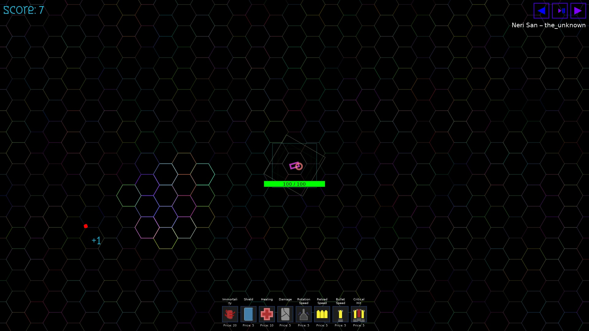

# PULSATING_CORE

Is a dynamic arcade tower defense game built with Lua and LÖVE2D. You control a powerful cannon at the center of the screen and must defend it from increasingly difficult enemy waves.


*Picture 1: Game screenshot*

### Features

- **Enemy variety** – circles, squares, triangles, rectangles, and legendary units with different speed, health, and damage
- **Upgrade system** – 8 enhancements (immortality, shield, healing, damage, rotation speed, reload speed, bullet speed, critical hit). Prices increase after each purchase
- **Audio** – MP3 background music with in-game controls (next/previous track, mute, volume), sound effects for shooting, reloading, and hits
- **Cyberpunk UI** – semi‑transparent menus with gradient buttons, player stats (best score, time played), authors page
- **Save system** – best score and playtime are stored locally
- **Fullscreen support** – immersive experience from the start

### How to play

- Move mouse → rotate cannon
- Left click → shoot
- `ESC` → open menu (continue, authors, stats, exit)
- `R` → restart after game over
- Music keys: `M` (mute), `←`/`→` (prev/next track), `P` (pause), `+`/`-` (volume)

### Run the game

1. Install [LÖVE2D](https://love2d.org/)
2. Clone the repository:
   ```bash
   git clone https://github.com/tailogs/pulsating-core.git
   ```
3. Run:
   ```bash
   love pulsating-core
   ```
